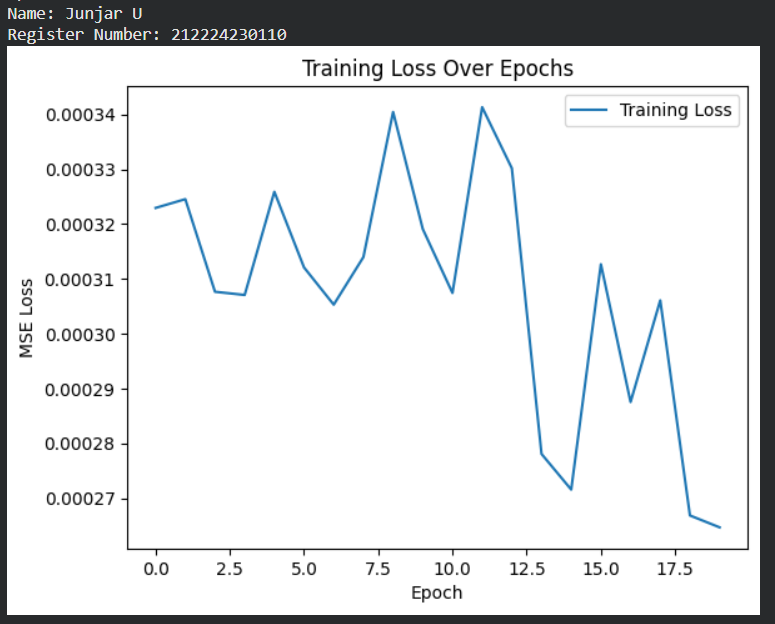
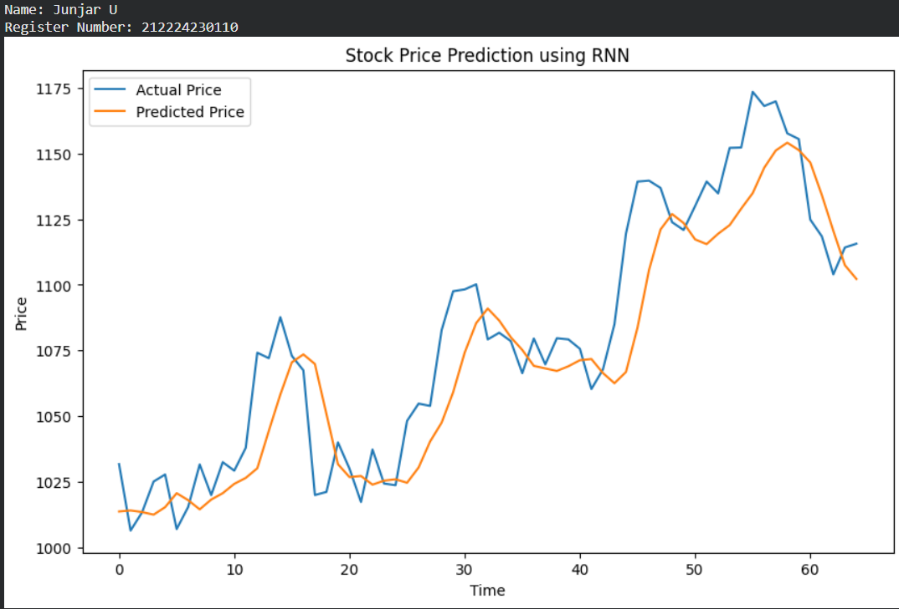
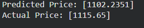

# DL- Developing a Recurrent Neural Network Model for Stock Prediction

## AIM
To develop a Recurrent Neural Network (RNN) model for predicting stock prices using historical closing price data.

## Problem Statement and Dataset

### Problem Statement

The project aims to build and evaluate an RNN-based sequence-to-sequence model that transliterates words from Roman script into a native language script using deep learning.


## DESIGN STEPS
### STEP 1: 

Load and normalize data, create sequences.

### STEP 2: 

Convert data to tensors and set up DataLoader.

### STEP 3: 

Define the RNN model architecture


### STEP 4: 

Summarize, compile with loss and optimizer.


### STEP 5: 

Train the model with loss tracking.


### STEP 6: 

Predict on test data, plot actual vs. predicted prices.


## PROGRAM

### Name: Junjar U

### Register Number: 212224230110

```python
# Define RNN Model
class RNNModel(nn.Module):
  def __init__(self,input_size=1,hidden_size=64,num_layers=2,output_size=1):
    super(RNNModel,self).__init__()
    self.rnn=nn.RNN(input_size,hidden_size,num_layers,batch_first=True)
    self.fc=nn.Linear(hidden_size,output_size)
  def forward(self,x):
    out,_=self.rnn(x)
    out=self.fc(out[:,-1,:])
    return out


## Train the Model
def train_model(model, train_loader, criterion, optimizer, epochs=20):
    train_losses = []
    model.train()
    for epoch in range(epochs):
      total_loss=0
      for x_batch,y_batch in train_loader:
        x_batch,y_batch=x_batch.to(device),y_batch.to(device)
        optimizer.zero_grad()
        outputs=model(x_batch)
        loss=criterion(outputs,y_batch)
        loss.backward()
        optimizer.step()
        total_loss+=loss.item()
      train_losses.append(total_loss/len(train_loader))
      print(f'Epoch {epoch+1}/{epochs}, Loss: {total_loss/len(train_loader):.4f}')
```

### OUTPUT

## Training Loss Over Epochs Plot



## True Stock Price, Predicted Stock Price vs time



### Predictions



## RESULT

Thus, a Recurrent Neural Network (RNN) model for predicting stock prices using historical closing price data has been developed successfully.
